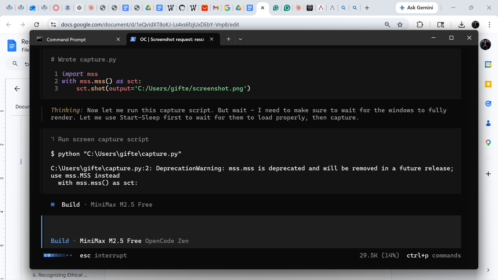

# Pocket CO Monitor

A compact, USB/battery-powered pocket carbon monoxide (CO) monitor built around the MQ-7 sensor. It displays CO levels as a percentage on a 0.96" OLED, shows SAFE/WARN/DANGER status, and provides audio alerts via a passive buzzer. Designed for educational and everyday awareness (not a certified life-safety device).

## Features

- **Pocket-sized**: 0.96" I2C OLED for a clean, modern UI
- **Portable Power**: TP4056 LiPo charger + MT3608 5V boost for battery/USB operation
- **Real-time Readings**: CO level shown as 0–100% with traffic-light status
- **Audio Alerts**: Passive buzzer with escalating beep intervals
- **Warm-up Timer**: Handles MQ-7 heater preheat on startup
- **Demo-ready**: Works in Wokwi and on real hardware

## Hardware

| Component | Notes |
|---|---|
| ESP32 DevKit V1 | Main MCU (XIAO ESP32C3 also works) |
| MQ-7 CO Gas Sensor | 5V heater; analog output |
| 0.96" SSD1306 OLED (I2C) | 128x64 |
| TP4056 LiPo Charger | Micro-USB charging |
| 3.7V LiPo Battery (500–800mAh) | Pocket-friendly |
| MT3608 Boost Converter | 3.7V → 5V for MQ-7 |
| Passive Buzzer (5V) | Audio alerts |
| SPDT Slide Switch | Power control |
| 2kΩ + 1kΩ Resistors | Voltage divider for 0–5V → 0–3.3V ADC |

## Wiring

MQ-7: VCC→5V, GND→GND, A0→voltage divider (2kΩ to ESP32 GPIO36, 1kΩ to GND). OLED: SDA→GPIO21, SCL→GPIO22, VCC→3.3V, GND→GND. Buzzer: +→GPIO4, –→GND.

## Getting Started

1. Clone this repo
2. Open `pocket_co_monitor.ino` in Arduino IDE (or PlatformIO)
3. Install libraries: `Adafruit GFX`, `Adafruit SSD1306`
4. Upload to ESP32
5. Power on and wait ~60s for warm-up
6. Test in Wokwi using `diagram.json` or on hardware

## Wokwi Simulation

Import `diagram.json` into a new Wokwi ESP32 project and run the simulation. Use the MQ-7 CO slider to test.

## Safety Notice

This is an educational/demo project. It is **not a certified carbon monoxide alarm**. Do not rely on it for life safety.

## License

MIT License
